# IMPLEMENT
## _Projeto de Monitoramento e Racionamento de Água Inteligente para Residências_
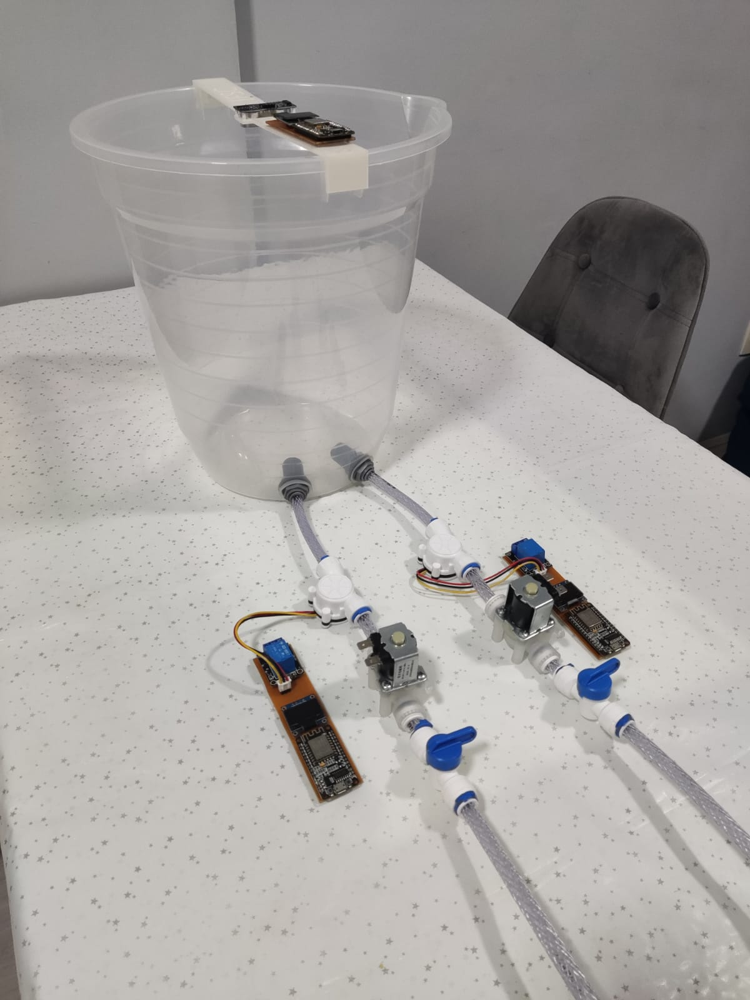

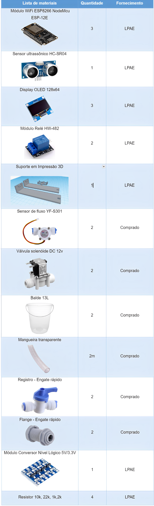
### CIRCUITO DE CONTROLE DE NÍVEL E PROCESSAMENTO DE DADOS
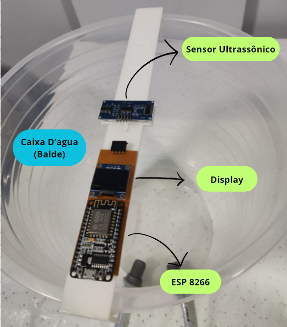
### Sensor Ultrassónico: 
No projeto, o sensor ultrassônico foi instalado na parte superior da caixa d'água, desempenhando um papel crucial ao permitir a medição  do nível de água na caixa. Esse dispositivo utiliza ondas sonoras de alta frequência para calcular a distância entre o sensor e a superfície da água.

Contudo, para determinar o volume de água na caixa d'água, é preciso as dimensões internas da caixa (nesse caso o balde). Levando em conta que o formato do reservatório é uma geometria de tronco de cone, a fórmula para calcular o volume (V) é adaptada para essa geometria específica da seguinte maneira:

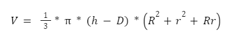

Onde:
- R é o raio maior da caixa d’água
- r é o raio menor da caixa d’água
- h é a altura da caixa d’água
- D é a distância do sensor e a superfície da água
- (h-D) é a distância do fundo do reservatório até a superfície da água.

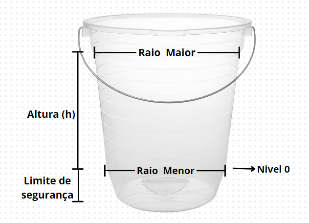

### Display OLED:
No nosso projeto, adotamos um display OLED 128x64 I2C para criar uma interface visual eficiente. Integrado ao sistema de controle, esse display, com sua resolução de 128x64 pixels, apresenta de forma clara as informações cruciais. A comunicação I2C foi escolhida para facilitar a interação com outros dispositivos, otimizando a eficácia do sistema. 
### ESP 8266 (Caixa d’água):
No nosso projeto, o microcontrolador ESP8266 é o cérebro que comanda tudo, responsável por processar os dados dos sensores e garantir o perfeito funcionamento de tudo. Ele está conectado a vários dispositivos para gerenciar de forma inteligente e em tempo real o nível de água na caixa.

Nós usamos o ESP8266 para receber dados dos sensores, sendo o intermediário para garantir que todas as informações necessárias cheguem até nós. Por exemplo, o sensor ultrassônico nos manda dados sobre a distância da água, e o ESP8266 faz os cálculos necessários para determinar o volume na caixa.

Além disso, ele está conectado à rede Wi-Fi, usando o protocolo MQTT para conversar com outros dispositivos através de um Broker, como o test.mosquitto.org (servidor gratuito para comunicação MQTT). Isso nos permite pegar informações importantes de outros sensores.

Mas não é só isso. O ESP8266 não só recebe dados, mas também se comunica de volta. Ele nos envia informações sobre o nível do reservatório para outros dispositivos conectados ao mesmo broker. Essa troca de informações é fundamental para manter tudo funcionando.
### Esquemático do circuito de controle de nível e processamento de dados:

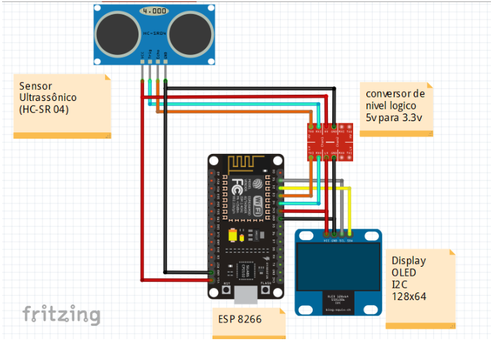

Este circuito tem como principal função a medição precisa do volume de água em um reservatório, bem como a recepção e processamento de dados dos sensores. Conectado ao ESP (ESP8266), o sensor ultrassônico é alimentado por 5V e GND, com as saídas Trigger e Echo conectadas às entradas do conversor de nível, que ajusta as tensões de 5v para 3.3v,  e a saídas do conversor estão conectadas as entradas D3 (GPIO 02) e D2 (GPIO 00) respectivamente.

Também conectados ao ESP temos o display OLED de 128x64 pixels. Esse display é alimentado com 3.3V e GND do ESP, enquanto as portas de comunicação SCL e SDA do display estão conectadas às portas D1 (GPIO 05) e D2 (GPIO 04) do ESP, respectivamente. Essas portas são comumente usadas para comunicação I2C.
### Código de controle de nível e processamento de dados 
```cpp
#include <ESP8266WiFi.h>
#include <PubSubClient.h>

//Bibliotecas para o controle do display
#include <Wire.h>
#include <Adafruit_GFX.h>
#include <Adafruit_SSD1306.h>
#include <Fonts/FreeSerif12pt7b.h>

// Define altura e largura do display (em pixels)
#define LARGURA_OLED 128
#define ALTURA_OLED 64

//Como o OLED que estamos utilizando não possui um pino RESET, enviamos -1 ao construtor para que nenhum dos pinos do Arduino seja utilizado como um reset para o display.
#define RESET_OLED -1

//Objeto display, para que o controle possa ser feito biblioteca Adafruit SSD1306.
Adafruit_SSD1306 display(LARGURA_OLED, ALTURA_OLED, &Wire, RESET_OLED);

//WiFi
const char* SSID = "Apollo2.4";       // SSID / nome da rede WiFi que deseja se conectar
const char* PASSWORD = "Binho2000@";  // Senha da rede WiFi que deseja se conectar
WiFiClient wifiClient;

//MQTT Server
const char* BROKER_MQTT = "test.mosquitto.org";  //URL do broker MQTT que se deseja utilizar
int BROKER_PORT = 1883;                          // Porta do Broker MQTT

#define ID_MQTT "BCI2000"               //ID para comunicaçao
#define TOPIC_PUBLISH_0 "Litros@"       //Topico de envio de "litros"
#define TOPIC_PUBLISH_1 "Racionamento@" //Topico de envio estado do racionamento 0,1,2

PubSubClient MQTT(wifiClient);  // Instancia o Cliente MQTT passando o objeto espClient

//Declaração das Funções
void mantemConexoes();  //Garante que as conexoes com WiFi e MQTT Broker se mantenham ativas
void conectaWiFi();     //Faz conexão com WiFi
void conectaMQTT();     //Faz conexão com Broker MQTT

//define os pinos do sensor ultrasonico
#define trig 2  // D4 Pino de disparo (Trigger)
#define echo 0  // D3 Pino de eco (Echo)

//define as Proporçoes do reservatorio 
#define Raio_menor 10.5
#define Raio_maior 13
#define Nivel_0 23.83 //define nivel 0 da do reservatorio
#define Litro_racionamento 2  // define em quantos litros deve entrar em racionamento 

void trigPulse();  //Função que gera o pulso de trigger

float pulse;    //Variável que armazena o tempo de duração do echo
float dist_cm;  //Variável que armazena o valor da distância em centímetros

void setup() {

  Serial.begin(115200);  //Inicia comunicação serial
  display.begin(SSD1306_SWITCHCAPVCC, 0x3C);
  display.clearDisplay();

  pinMode(trig, OUTPUT);  //Pino de trigger será saída digital
  pinMode(echo, INPUT);   //Pino de echo será entrada digital

  digitalWrite(trig, LOW);  //Saída trigger inicia em nível baixo

  conectaWiFi();
  MQTT.setServer(BROKER_MQTT, BROKER_PORT);
}

void loop() {
  mantemConexoes();
  enviaValores();
  MQTT.loop();
}

void mantemConexoes() {
  if (!MQTT.connected()) {
    conectaMQTT();
  }

  conectaWiFi();  //se não há conexão com o WiFI, a conexão é refeita
}

void conectaWiFi() {

  if (WiFi.status() == WL_CONNECTED) {
    return;
  }

  Serial.print("Conectando-se na rede: ");
  Serial.print(SSID);
  Serial.println("  Aguarde!");

  WiFi.begin(SSID, PASSWORD);  // Conecta na rede WI-FI
  while (WiFi.status() != WL_CONNECTED) {
    delay(100);
    Serial.print(".");

    // Imprimir "IFSC" no Display OLED
    display.clearDisplay();
    display.setTextSize(5);
    display.setTextColor(WHITE);
    display.setCursor(0, 15);
    display.println("IFSC");

    display.display();
  }

  Serial.println();
  Serial.print("Conectado com sucesso, na rede: ");
  Serial.print(SSID);
  Serial.print("  IP obtido: ");
  Serial.println(WiFi.localIP());
}

void conectaMQTT() {
  while (!MQTT.connected()) {
    Serial.print("Conectando ao Broker MQTT: ");
    Serial.println(BROKER_MQTT);
    if (MQTT.connect(ID_MQTT)) {
      Serial.println("Conectado ao Broker com sucesso!");
    } else {
      Serial.println("Noo foi possivel se conectar ao broker.");
      Serial.println("Nova tentatica de conexao em 10s");
      delay(10000);
    }
  }
}

void enviaValores() {

  trigPulse();  //Aciona o trigger do módulo ultrassônico

  pulse = pulseIn(echo, HIGH);  //Mede o tempo em que o pino de echo fica em nível alto

  dist_cm = pulse / 58.82;  //Valor da distância em centímetros

  // 340m/s
  // 34000cm/s

  /*
        100000 us - 17000 cm/s
             x us - 1cm
           1E6
      x = -----
          17E3
   */

  // Medir a distância em centímetros

  
  float volume = 1.0 / 3 * 3.1415 * (Nivel_0 - dist_cm) * (Raio_maior * Raio_maior + Raio_menor * Raio_menor + (Raio_maior * Raio_menor)); //fomula do cone cotado, para calcular o volume do reservatorio   
  float Litros = volume / 1000; //converte CM^3 para litros
  int racionamento = 0; 
  int Corte_total = 0;


  Serial.print("Litros: ");
  Serial.print(Litros);
  Serial.println(" L");

  Serial.print("Volume: ");
  Serial.print(volume);
  Serial.println(" cm^3");

  Serial.print("Distancia: ");
  Serial.print(dist_cm);
  Serial.println(" cm");

  if (Litros > Litro_racionamento) {

    racionamento = 0;

    // Imprimir o valor em litros no Display OLED
    display.clearDisplay();
    display.setTextSize(3);
    display.setTextColor(WHITE);
    display.setCursor(0, 10);
    display.println(Litros);
    display.print("Litros");
    display.display();
    delay(500);  //Taxa de atualização

  } else if (Litros <= Litro_racionamento && Litros > 0) {

    racionamento = 1;

    // Imprimir o valor em litros no Display OLED
    display.clearDisplay();
    display.setTextSize(3);
    display.setTextColor(WHITE);
    display.setCursor(0, 10);
    display.print(Litros);
    display.println(" L");
    display.setTextSize(2);
    display.print("Nivel\nbaixo");
    display.display();
    display.invertDisplay(true);
    delay(250);
    display.invertDisplay(false);
    delay(250);


  } else {
    racionamento = 2;
    Litros = 0.00;

    // Imprimir o valor em litros no Display OLED
    display.clearDisplay();
    display.setTextSize(3);
    display.setTextColor(WHITE);
    display.setCursor(0, 10);
    display.println("0.00 L");
    display.setTextSize(2);
    display.print("Em Corte");
    display.display();
    display.invertDisplay(true);
    delay(250);
    display.invertDisplay(false);
    delay(500);
  }

  // Envia o valor em litros
  String mensagem = String(Litros, 2);              // 2 casas decimais
  MQTT.publish(TOPIC_PUBLISH_0, mensagem.c_str());  // Converte a String para const char* usando c_str()

  // Manda o estado do racionamento
  String mensagem_1 = String(racionamento);           // 2 casas decimais
  MQTT.publish(TOPIC_PUBLISH_1, mensagem_1.c_str());  // Converte a String para const char* usando c_str()

}

void trigPulse() {
  digitalWrite(trig, HIGH);  //Pulso de trigger em nível alto
  delayMicroseconds(10);     //duração de 10 micro segundos
  digitalWrite(trig, LOW);   //Pulso de trigge em nível baixo
}
 ```

##### Inicialização e Bibliotecas:
O código começa incluindo as bibliotecas necessárias, como a **ESP8266WiFi** para a comunicação Wi-Fi, **PubSubClient** para MQTT, e bibliotecas para controlar o display OLED. Em seguida, são definidas algumas constantes e inicializados objetos importantes, como o objeto **display** para controlar o OLED e o objeto **MQTT** para interação com o servidor MQTT.

##### Configuração Inicial:
O **setup()** realiza as configurações iniciais. Inicia a comunicação serial, configura o display OLED, define os pinos do sensor ultrassônico, inicia a conexão Wi-Fi e configura o servidor MQTT.
##### Loop Principal:
O **loop()** é a função principal que é executada continuamente. Ela chama a função **mantemConexoes()** para garantir que as conexões Wi-Fi e MQTT estejam ativas, chama a função **enviaValores()** para obter as leituras do sensor ultrassônico e publicar no servidor MQTT, e utiliza **MQTT.loop()** para manter a comunicação MQTT funcionando.

##### Função **enviaValores()**:
Esta função realiza a leitura do sensor ultrassônico para obter a distância até o líquido no reservatório. Com base nessa distância, calcula o volume de água no reservatório usando a fórmula de um tronco de cone. Em seguida, converte esse volume para litros e publica as informações no servidor MQTT. O programa também atualiza o display OLED com informações sobre o nível de líquido e se há racionamento.
##### Funções de Conexão:
As funções **conectaWiFi()** e **conectaMQTT()** são responsáveis por estabelecer e manter as conexões Wi-Fi e MQTT, respectivamente. A função **mantemConexoes()** é utilizada para verificar se as conexões estão ativas e, caso não estejam, restabelecer a conexão.
##### Função trigPulse():
A função **trigPulse()** é responsável por gerar um pulso no pino de trigger do sensor ultrassônico, iniciando a medição da distância.

Em resumo, este código é projetado para medir o nível de água em um reservatório usando um sensor ultrassônico, calcula o volume de água e envia essas informações para um broker MQTT. O sistema também exibe informações relevantes em uma tela OLED.
### Construção do circuito de controle de nível e processamento de dados

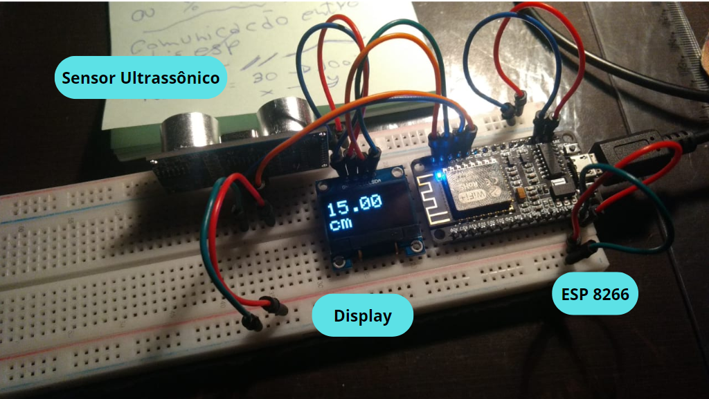

Os testes realizados na matriz de contato revelaram resultados promissores quanto ao progresso do projeto, impulsionando-nos a dar início à fase de construção dos circuitos em placas de fenolite. Inicialmente, desenvolvemos o esquemático no KiCad, e em seguida, procedemos com a implementação correspondente nas placas de circuito impresso (PCI).

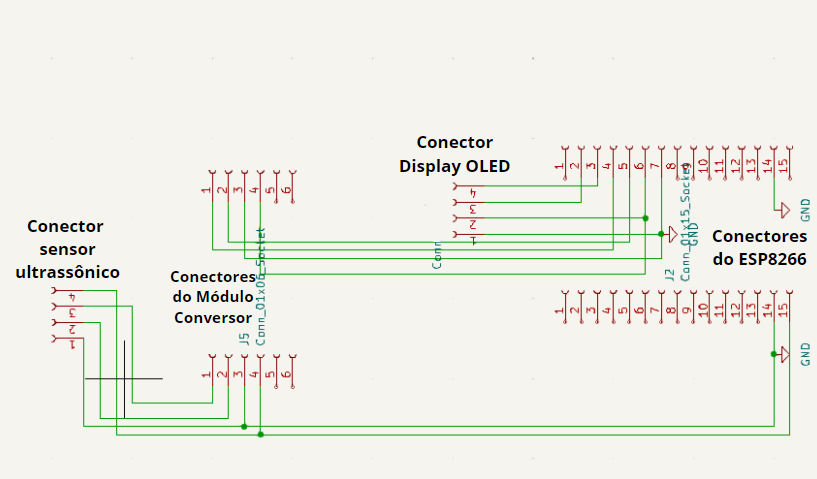

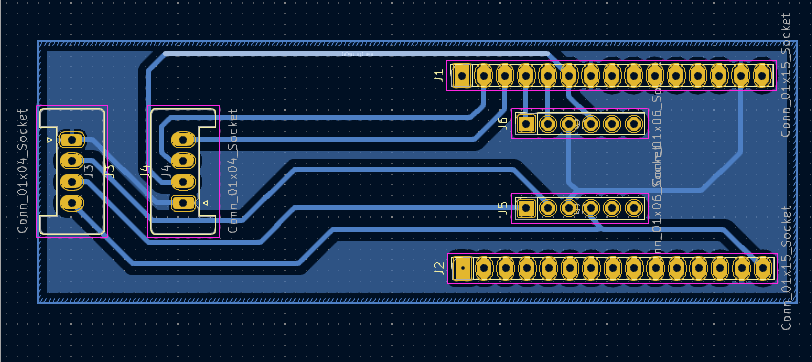

Após uma série de aprimoramentos na PCI, demos início ao processo de corrosão da placa de fenolite, um passo crucial na fabricação de circuitos impressos, especialmente quando empregamos o percloreto de ferro como agente corrosivo.

Durante o procedimento de corrosão com percloreto de ferro, as trilhas de cobre na fenolite são deliberadamente expostas a esse agente corrosivo. Essa fase visa eliminar o excesso de cobre, revelando o padrão desejado do circuito impresso. O percloreto de ferro atua como um agente gravador, dissolvendo o cobre não protegido e expondo as trilhas do circuito.

É crucial controlar com precisão o tempo de exposição ao percloreto de ferro, pois a corrosão excessiva pode comprometer a integridade estrutural das trilhas, potencialmente resultando em falhas no circuito. Após o processo de corrosão, realizamos uma limpeza meticulosa para eliminar resíduos de percloreto, evitando possíveis problemas futuros de corrosão.

Para prevenir a corrosão indesejada nas placas de fenolite, implementamos a aplicação de um revestimento protetor (verniz) nas trilhas do circuito. Essa prática estabelece uma barreira eficaz contra a oxidação da placa. 

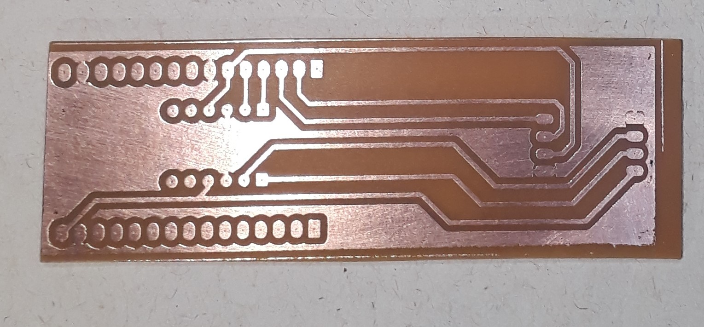

Diante da constatação de corrosão na placa, embarcamos no processo de soldagem dos componentes essenciais. Neste momento, a habilidade técnica torna-se crucial para garantir uma conexão elétrica robusta, restaurando não apenas a funcionalidade da placa, mas também preservando a integridade do circuito. Mantemos uma atenção especial para evitar a ocorrência de solda fria, reconhecendo que uma união inadequada poderia comprometer a eficácia e a estabilidade do circuito eletrônico. Cada junção soldada representa um passo determinante na recuperação da placa corroída, com a precisão e destreza desempenhando papéis fundamentais no restabelecimento da performance e confiabilidade do dispositivo eletrônico.

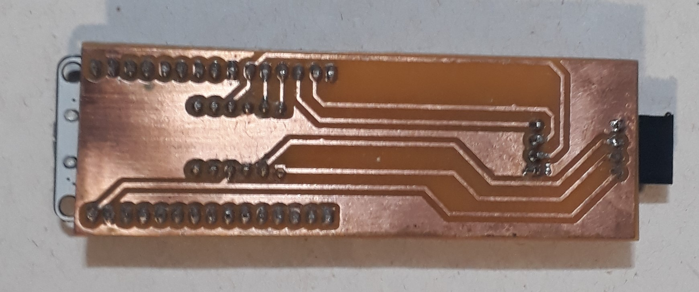

### Suporte em impressão 3D para o Sensor Ultrassônico 
Por meio da plataforma Tinkercad, realizamos a modelagem tridimensional do suporte do nosso projeto:


Foi constatado que a impressão não seria viável devido ao tamanho exceder as dimensões da mesa da impressora. Diante desse desafio, com modificações significativas na estrutura e o suporte dos professores e chefes de laboratório, conseguimos imprimir o modelo dividindo em três peças encaixáveis. 

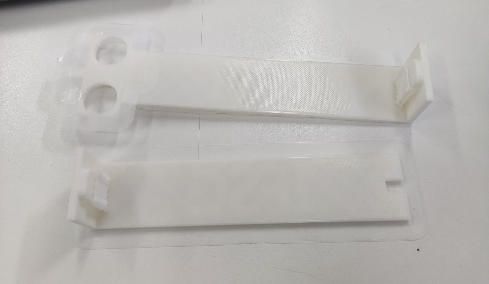

Ao utilizar a impressão 3D, conseguimos uma abordagem personalizada e detalhada, permitindo-nos esculpir um suporte sob medida para se adequar perfeitamente com a dinâmica do nosso sensor ultrassônico.

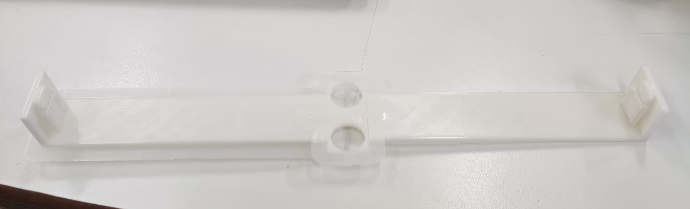

### CIRCUITO DE CONTROLE DE FLUXO

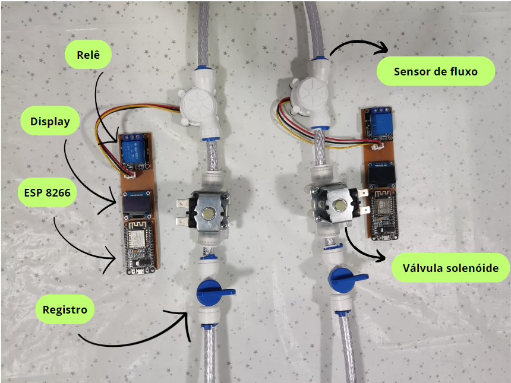

### Válvula solenóide:
Foi utilizada uma válvula solenóide para o controle do fluxo de água. Esse dispositivo eletromecânico opera por meio de uma abertura ou fechamento controlado por um campo magnético gerado por uma bobina solenóide. A função principal da válvula solenóide é interromper o fluxo de água quando o usuário ultrapassa os limites de consumo no modo de racionamento.

No cenário de racionamento de água, sempre que os limites de consumo são atingidos, o ESP entra em ação ativando a válvula solenóide, o que resulta na interrupção imediata do fluxo de água. O relé desempenha um papel crucial como chave de controle nesse processo. Quando o ESP emite um sinal elétrico para ativar a válvula solenóide, esse sinal é enviado para o relé, que, por sua vez, proporciona a tensão específica necessária à válvula solenóide. Esse processo de ativação da válvula é fundamental para permitir ou interromper o fluxo de água conforme necessário.
### Sensor de fluxo:
O sensor de fluxo de água, outro componente vital do nosso sistema, regula a vazão durante o modo de racionamento. Este dispositivo mede a taxa ou volume de água que passa por ele, fornecendo informações cruciais para o controle eficaz do consumo de água em nosso projeto.
### Esquemático do circuito de controle de fluxo:


O sistema consiste em dois circuitos idênticos, simulando o consumo de água em uma residência. O objetivo é monitorar o consumo e, se necessário, interromper o fornecimento quando um limite é ultrapassado.

Conectados ao microcontrolador ESP, temos dois dispositivos principais. O sensor de fluxo, alimentado com 3.3V e GND, gera pulsos cuja frequência está relacionada à velocidade do fluxo de água. Quanto mais rápido a água flui, maior a taxa de rotação do rotor, proporcionando uma medição precisa do consumo.

A válvula solenóide, com dois terminais, é controlada por um relé. Para fornecer os 12V necessários à válvula, o relé é alimentado com 5V e GND do ESP. Um fio conectado à porta GPIO10 do ESP controla o relé. Ao ativar essa porta, o relé abre ou fecha, permitindo a aplicação ou interrupção da tensão de 12V na válvula. Isso oferece um meio eficaz de gerenciar o consumo de água.

### Código de controle de fluxo
```cpp
#include <ESP8266WiFi.h>
#include <PubSubClient.h>
#include <Wire.h>
#include <Adafruit_GFX.h>
#include <Adafruit_SSD1306.h>
#include <Fonts/FreeSerif12pt7b.h>

// WiFi
const char* SSID = "Apollo2.4";
const char* PASSWORD = "Binho2000@";
WiFiClient wifiClient;

// MQTT Server
const char* BROKER_MQTT = "test.mosquitto.org";
int BROKER_PORT = 1883;

#define ID_MQTT "BCI2001"
#define TOPIC_SUBSCRIBE_0 "Litros@"
#define TOPIC_SUBSCRIBE_1 "Racionamento@"

PubSubClient MQTT(wifiClient);
Adafruit_SSD1306 display(128, 64, &Wire, -1);

// Sensor de fluxo
const int PINO_SENSOR_FLUXO = 2;
volatile unsigned long pulsos = 0;
float volumeAcumuladoTotal = 0.0;
float VolumeAcumuladoIns = 0.0;
float volume_stop = 0.0;
unsigned long tempoAnterior = 0;

//Rele da solenoide
const int PINO_RELE_SOLENOIDE = 0;

// Constantes de calibração
const float PULSOS_POR_LITRO = 900;
const unsigned long INTERVALO_FLUXO = 1000;  // Intervalo desejado em milissegundos

unsigned long ultimoTempoFluxo = 0;

float litros = 0.0;    // Declare a variável litros como global
int racionamento = 0;  // Declare a variável Racionamento como global

void ICACHE_RAM_ATTR contadorPulsos() {
  pulsos++;
}

void setup() {
  Serial.begin(115200);
  display.begin(SSD1306_SWITCHCAPVCC, 0x3C);
  display.clearDisplay();

  conectaWiFi();
  MQTT.setServer(BROKER_MQTT, BROKER_PORT);
  MQTT.setCallback(recebePacote);

  pinMode(PINO_RELE_SOLENOIDE, OUTPUT);
  pinMode(PINO_SENSOR_FLUXO, INPUT);
  attachInterrupt(digitalPinToInterrupt(PINO_SENSOR_FLUXO), contadorPulsos, RISING);
}

void loop() {
  mantemConexoes();
  MQTT.loop();
  verificaFluxo();
  estados();
}

void mantemConexoes() {
  if (!MQTT.connected()) {
    conectaMQTT();
  }
  conectaWiFi();
}

void conectaWiFi() {
  if (WiFi.status() == WL_CONNECTED) {
    return;
  }

  Serial.print("Conectando-se na rede: ");
  Serial.print(SSID);
  Serial.println("  Aguarde!");

  WiFi.begin(SSID, PASSWORD);
  while (WiFi.status() != WL_CONNECTED) {
    delay(100);
    Serial.print(".");

        // Imprimir "IFSC" no Display OLED
    display.clearDisplay();
    display.setTextSize(5);
    display.setTextColor(WHITE);
    display.setCursor(0, 15);
    display.println("IFSC");

    display.display();
  }

  Serial.println();
  Serial.print("Conectado com sucesso, na rede: ");
  Serial.print(SSID);
  Serial.print("  IP obtido: ");
  Serial.println(WiFi.localIP());
}

void conectaMQTT() {
  while (!MQTT.connected()) {
    Serial.print("Conectando ao Broker MQTT: ");
    Serial.println(BROKER_MQTT);
    if (MQTT.connect(ID_MQTT)) {
      Serial.println("Conectado ao Broker com sucesso!");
      MQTT.subscribe(TOPIC_SUBSCRIBE_0);
      MQTT.subscribe(TOPIC_SUBSCRIBE_1);
    } else {
      Serial.println("Não foi possível se conectar ao broker.");
      Serial.println("Nova tentativa de conexão em 10s");
      delay(10000);
    }
  }
}

void recebePacote(char* topic, byte* payload, unsigned int length) {
  String mensagem = String((char*)payload);

  // Identifique qual tópico está sendo recebido
  if (strcmp(topic, TOPIC_SUBSCRIBE_0) == 0) {
    // Se for o tópico Litros@
    litros = mensagem.toFloat();

  } else if (strcmp(topic, TOPIC_SUBSCRIBE_1) == 0) {
    // Se for o tópico Racionamento@
    racionamento = mensagem.toFloat();
  }
}

void verificaFluxo() {
  unsigned long tempoAtual = millis();

  if (tempoAtual - ultimoTempoFluxo >= INTERVALO_FLUXO) {
    calcularFluxo();
    ultimoTempoFluxo = tempoAtual;
  }
}

void calcularFluxo() {
  unsigned long tempoDecorrido = millis() - tempoAnterior;
  volumeAcumuladoTotal += pulsos / PULSOS_POR_LITRO;
  float fluxo = (pulsos / PULSOS_POR_LITRO) / (tempoDecorrido / 60000.0);

  // Zera a contagem de pulsos para o próximo cálculo
  pulsos = 0;

  tempoAnterior = millis();
}

void estados() {
  if (racionamento == 0) {

    digitalWrite(0, LOW);  // Abre a Valvula solenoide

    VolumeAcumuladoIns = 0.00;
    volume_stop = 0.00;

    display.clearDisplay();
    display.setTextSize(3);
    display.setTextColor(WHITE);
    display.setCursor(10, 3);
    display.print(litros);
    display.println(" L");
    display.setTextSize(2);
    display.print("  Caixa\n  d'Agua");
    display.display();

  } else if (racionamento == 1) {

    if (VolumeAcumuladoIns == 0) {
      VolumeAcumuladoIns = volumeAcumuladoTotal;
    }

    if (volume_stop < 1 && racionamento == 1) {

      digitalWrite(PINO_RELE_SOLENOIDE, LOW);
      volume_stop = volumeAcumuladoTotal - VolumeAcumuladoIns;
      Serial.println(volume_stop);
      Serial.println(1 - volume_stop);

      display.clearDisplay();
      display.setTextSize(3);
      display.setTextColor(WHITE);
      display.setCursor(0, 10);
      display.print(1 - volume_stop);
      display.println("L");
      display.setTextSize(2);
      display.println("   Cota\nDisponivel");
      display.display();

    } else if (volume_stop >= 1 && racionamento == 1) {

      digitalWrite(PINO_RELE_SOLENOIDE, HIGH);

      display.clearDisplay();
      display.setTextSize(3);
      display.setTextColor(WHITE);
      display.setCursor(0, 10);
      display.println("0.00 L");
      display.print("Em corte");
      display.display();
    }


  } else if (racionamento == 2) {


    digitalWrite(PINO_RELE_SOLENOIDE, HIGH);  // Fecha a Valvula Solenoide

    // Imprimir o valor em litros no Display OLED
    display.clearDisplay();
    display.setTextSize(3);
    display.setTextColor(WHITE);
    display.setCursor(10, 3);
    display.println("0.00 L");
    display.setTextSize(2);
    display.print("  Caixa\n  d'Agua");
    display.display();
  }
}
``` 
O programa acima utiliza bibliotecas como **ESP8266WiFi** para a conexão Wi-Fi, **PubSubClient** para comunicação MQTT, e **Adafruit_GFX** e **Adafruit_SSD1306** para controlar um display OLED.

As credenciais de Wi-Fi e o endereço/porta do servidor MQTT são definidos no início do código. O código configura também pinos para o sensor de fluxo e o relé da solenoide, além de constantes para calibração do sistema.

Uma função de interrupção (**contadorPulsos**) é usada para contar os pulsos do sensor de fluxo. O programa tem uma função de configuração (**setup**) e um loop principal (**loop**) que mantém conexões, lida com MQTT, verifica o fluxo e controla estados.

As funções **conectaWiFi** e **conectaMQTT** garantem conexões ativas. A função **recebePacote** é chamada quando mensagens MQTT são recebidas, atualizando as variáveis **litros** e **racionamento**. A função **verificaFluxo** calcula o fluxo periodicamente.

O display OLED é utilizado para mostrar a quantidade de litros, a cota disponível (em caso de racionamento) e mensagens relacionadas ao estado do sistema.

Em resumo, o código recebe as informações de nível de água e estados de racionamento, enviadas pelo sistema de controle de nível, para que assim monitore e gerencie o fluxo de água em para determinada unidade consumidora, especialmente em situações de racionamento. Além disso as informações de consumo, cota de água disponível (em caso de racionamento) e estado de racionamento são enviados para o broker, para que assim posso ser acessados remotamente através de um aplicativo.
### Construção do circuito de controle de fluxo
Após validar o circuito na matriz de contato, avançamos para a fabricação das duas placas que representam duas unidades consumidoras. Utilizamos os mesmos métodos empregados na placa do circuito de controle de nível e processamento de dados. A seguir, as imagens dos processos:

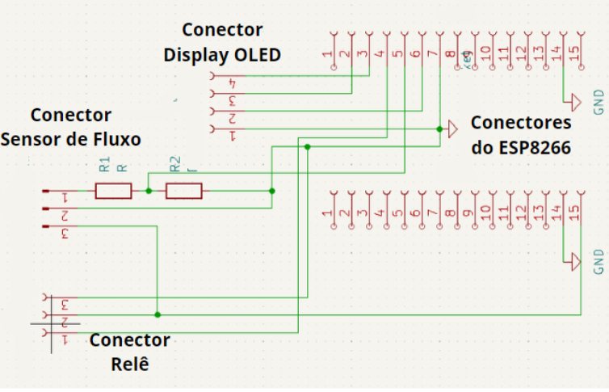


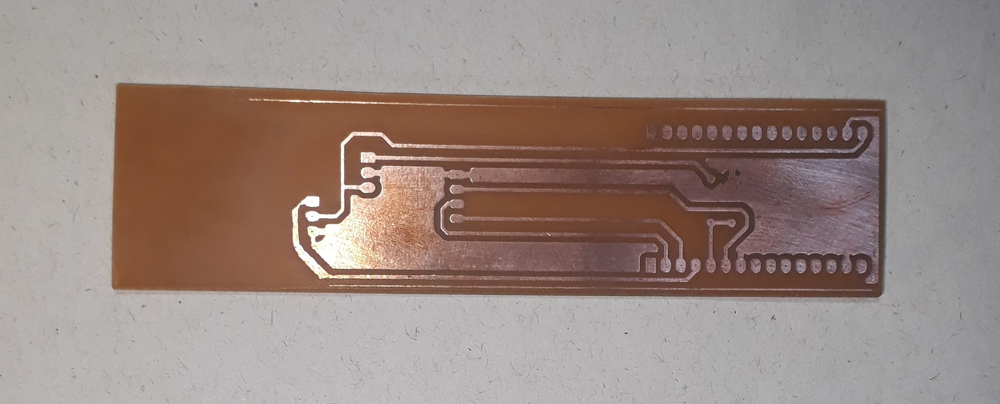

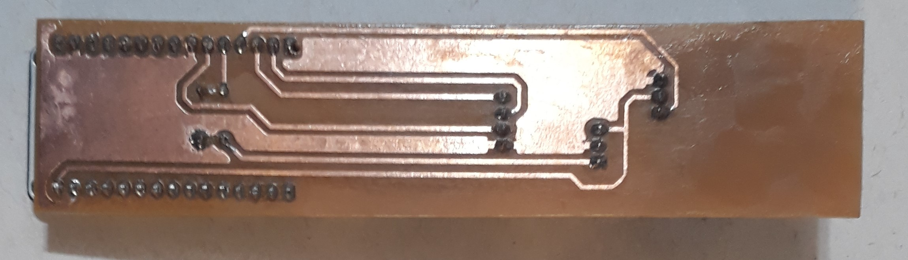

### APLICATIVO
O projeto inclui um aplicativo chamado **MQTT Dashboard** disponível na Play Store. Este aplicativo é capaz de se conectar ao broker e receber informações enviadas pelo circuito de controle de fluxo. Para utilizá-lo, é necessário fornecer o endereço e a porta do servidor, bem como o tópico ao qual deseja se cadastrar.

Endereço do servidor: test.mosquitto.org
Porta do servidor: 1883
Tópicos:
**Racionamento@**: Informa o estado atual do reservatório  .
**Litros@**: Informa a cota em litros disponível.
Com essas informações, é possível configurar o aplicativo para receber as atualizações do circuito de controle de fluxo.

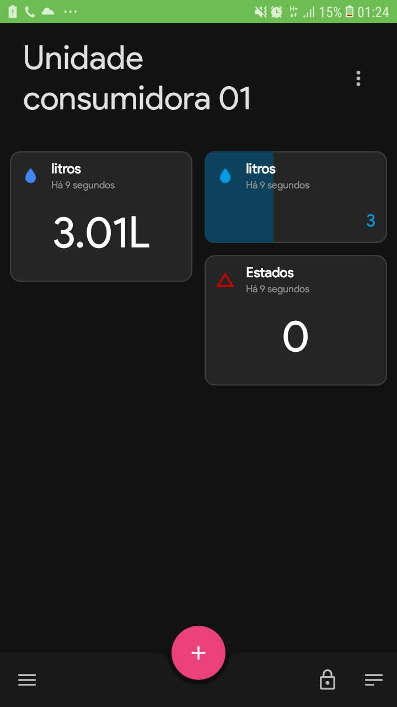

### DIAGRAMA DE FUNCIONAMENTO 
### Máquina de estados (Circuito de controle de nível e processamento de dados) 
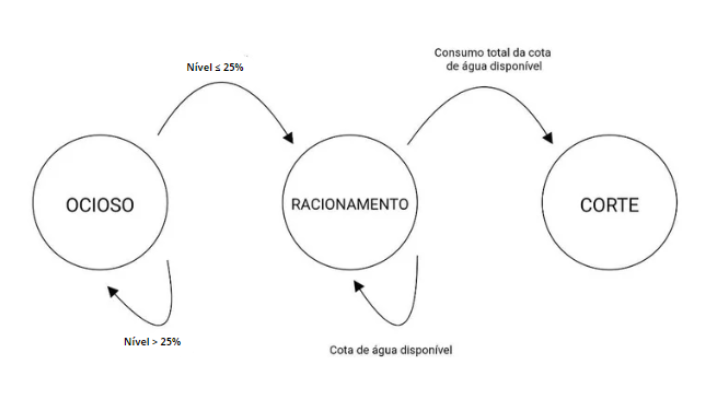

#### Estado Inicial (OCIOSO):
Descrição: O sistema está ocioso, monitorando continuamente o nível de água
##### Ações:
- Imprime o nível de água no display.
##### Transições:
- Se o nível de água for superior a 25%, permanece no estado ocioso.
- Se o nível de água atingir ou cair abaixo de 25%, transição para o estado de racionamento.
#### Estado de racionamento:
Descrição: O sistema identificou que o nível de água está abaixo de 25%, indicando a necessidade de racionamento.
##### Ações:
- Envia a variável racionamento = 1 para o servidor.
- Dividi o valor de litros de água disponível na caixa igualitariamente para cada residência.
- Faz a requisição para o servidor do consumo atual de casa residência.
- Monitora e registra o consumo volumétrico de água de cada residência.
- Se determinada residência atingir sua cota de volume de água, transição para o estado de corte.
#### Estado corte:
Descrição: O sistema identificou que o consumo da residência foi excedido, indicando a necessidade de corte fornecimento de água.
##### Ações: 
- Envia para o servidor a id da residência que deve ter o fornecimento de água cortado. 
### Máquina de estados (Circuito de controle de fluxo)


#### Estado Inicial (OCIOSO):
Descrição: Monitora se o sistema deve entrar em modo racionamento.
##### Ações: 
- Requisita o valor da variável racionamento para o servidor.
##### Transições:
- Se racionamento diferente de ‘1’, mentem-se no estado atual.
- Se racionamento = 1, transição para o estado de racionamento.
#### Estado de racionamento: 
Descrição: O sistema identificou que é necessário entrar em modo racionamento.
##### Ações: 
- Monitora o fluxo de água de cada residência e envia as informações para o servidor.
- Verifica no servidor existe registro do seu ID. 
##### Transições:
- Se de o ID estiver no servidor, entrar no estado corte
- Se o ID não estiver na lista, permanece no estado atual.
#### Estado corte:
Descrição: O sistema identificou que é necessário de cortar o fornecimento de água na residência.
##### Ações: 
- Aciona a válvula solenoide.


